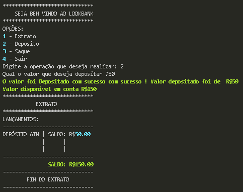
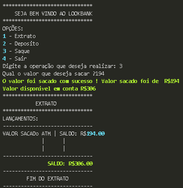
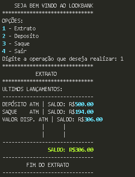
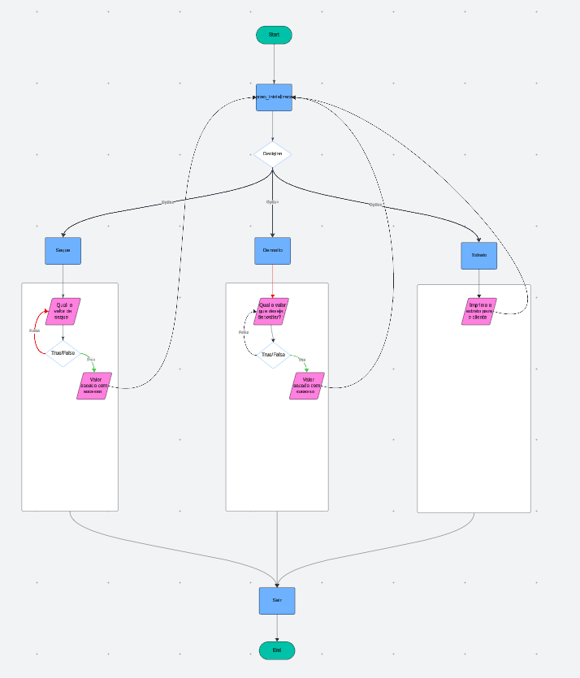

# Extrato do sistema

### Sobre a funcionabilidade:

* Inicialização do sistema envolve a interface inicial do usuario, onde ele tem 4 opções que o auxiliam na movimentação dentro do sistema.
* Quando o usuario realizado uma ação seja deposito ou saque ele sempre poderá ao final de sua trasação ver um resumo de sua trasação com o extrato que é mostrado no final da ação feita.

### Tratamentos:

* Foram feitos os tratamento de entradas e escolhas de opção dentro do sistema, incluindo:
    *   Se o usuario digitar alguma opção que não esteja dentro do esperado vai retonar uma mensagem grifado em vermelho informando sobre a ação que poderá ser execultada, lhe exibindo a tela de escolha novamente.
    *  Foi tratado tambem  entradas do usuario se caso ele digitar letras, ou simplemesmente de um espaço, o sistema lhe informara sobre um possivél erro, dizendo que ele deve digitar somente numeros naquele campo.

# Deposito do sistema

### Sobre a funcionabilidade:

* Sobre esta funcionabilidade o cliente vai estar realizando o seu deposito. Com base em algum valor que seja maior que R$0.00.
* Quando a ação é realizada ele emite os valores depositado e o valor que foi depositado na conta, com o saldo disponivél naquele momento.

### Tratamentos:

* Foram feitos os tratamento de entradas e escolhas de opção dentro do sistema, incluindo:
    *   Se o usuario digitar alguma opção que não esteja dentro do esperado vai retonar uma mensagem grifado em vermelho informando sobre a ação que poderá ser execultada, lhe exibindo a tela de escolha novamente.
    *  Foi tratado tambem  entradas do usuario se caso ele digitar letras, ou simplemesmente de um espaço, o sistema lhe informara sobre um possivél erro, dizendo que ele deve digitar somente numeros naquele campo.

# Saque do sistema

### Sobre a funcionabilidade:

* Sobre esta funcionabilidade o cliente vai estar realizando o seu saque. Com base em algum valor que seja maior que R$0.00.
* Quando a ação é realizada ele emite os valores depositado e o valor que foi depositado na conta, com o saldo disponivél naquele momento.

### Tratamentos:

* Foram feitos os tratamento de entradas e escolhas de opção dentro do sistema, incluindo:
    *   Se o usuario digitar alguma opção que não esteja dentro do esperado vai retonar uma mensagem grifado em vermelho informando sobre a ação que poderá ser execultada, lhe exibindo a tela de escolha novamente.
    *  Foi tratado tambem  entradas do usuario se caso ele digitar letras, ou simplemesmente de um espaço, o sistema lhe informara sobre um possivél erro, dizendo que ele deve digitar somente numeros naquele campo.

### Extrato do Sistema

### Sobre a funcionabilidade:

* Exibe todas as ultimas trasações  como o ultimo saque, deposito e saldo disponivel.

### Estrutura do Sistema em um fluxograma

